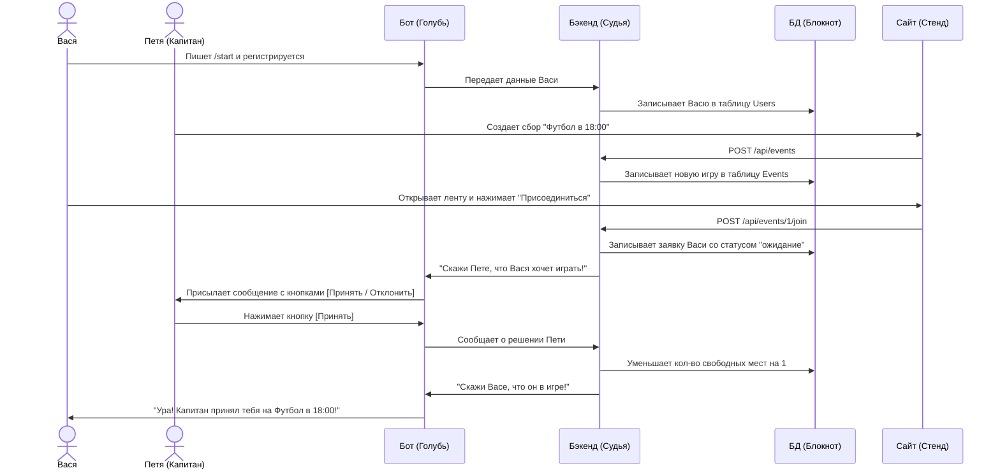

# 🍎 Шаг 1. Как это работает (на простых аналогиях)

Давай разберем, как наши четыре главных героя (База данных, Бэкенд, Бот и Фронтенд) дружат между собой и помогают игрокам собираться на спорт.

---

## 1. 📖 База данных (Блокнот) — Это наша Память

Представь себе обычную **школьную тетрадь в клеточку**. В ней записаны четыре таблицы:
*   **Игроки (Users):** Имя, возраст, описание и ссылка на фото в Telegram.
*   **Площадки (Venues):** Название (например, "Центральный стадион"), платное ли оно, сколько стоит аренда и где оно находится на карте.
*   **Игры / Сборы (Events):** Какая площадка забронирована, какой вид спорта (футбол/баскетбол), во сколько игра и сколько свободных мест осталось.
*   **Заявки (Applications):** Кто из игроков хочет прийти на какую игру.

**Главное правило:** Блокнот сам по себе ничего не делает. Он просто лежит на столе. Чтобы в него что-то записать или прочитать, нужен Бэкенд.

---

## 2. 🧠 Бэкенд (Умный Судья) — Это наш Мозг

Бэкенд — это программа, которая запущена на компьютере. Она работает как **строгий, но справедливый Судья**. 
Когда кто-то присылает запрос, Судья решает, что делать:
*   **Запрос от игрока:** *"Я хочу создать футбольный сбор на стадионе!"* 
    *   **Судья:** Проверяет в Блокноте, свободен ли стадион. Если всё хорошо, он берет карандаш и записывает новую игру в Блокнот.
*   **Запрос от другого игрока:** *"Я хочу записаться на этот футбол!"*
    *   **Судья:** Проверяет в Блокноте, есть ли еще свободные места. Если места есть, он записывает заявку. Если мест нет, он говорит: *"Извини, мест больше нет!"* (Это называется защитой от «гонки заявок», чтобы на поле не прибежало слишком много людей).

---

## 3. ✉️ Telegram-бот (Почтовый Голубь) — Это наше Общение

Бот — это **голубь-почтальон**, который общается с игроками в их любимом приложении Telegram.
*   **Регистрация:** Когда новый человек пишет боту `/start`, голубь вежливо спрашивает: *"Как тебя зовут? Сколько тебе лет? Отправь фото"*. Всё, что отвечает пользователь, голубь передает Умному Судье (Бэкенду), чтобы тот записал это в Блокнот.
*   **Кнопка входа:** Голубь выдает игроку специальную кнопку: **«Открыть приложение»**.
*   **Письма-уведомления:** Если капитан игры нажал кнопку «Принять тебя в игру» на сайте, Судья будит Голубя и говорит: *"Быстро лети к этому игроку и скажи, что его приняли!"*. И игрок получает сообщение в Telegram.

---

## 4. 📱 Фронтенд / Mini App (Информационный Стенд) — Это Красота

Фронтенд — это красивый сайт, который открывается прямо внутри Telegram, когда ты нажимаешь кнопку «Открыть приложение». 
Он нарисован с помощью **Vue.js** и выглядит как игра на телефоне:
*   Там есть **Лента** — карточки матчей, которые можно листать.
*   Там есть кнопка **«Создать игру»**, где можно выбрать спорт (например, Футбол) и площадку из списка.
*   Там есть вкладка **«История»**, где показано, на какие игры тебя уже приняли, а где ты еще ждешь ответа капитана.

---

## 🔄 Как все они работают вместе (Круговорот игры)

Давай посмотрим на один пример: **Игрок Вася хочет пойти играть в футбол с Петей.**

Вот так они общаются круглые сутки! Теперь переходи к [**Шагу 2 (Разбор файлов)**](file:///Users/aksunkar--/Downloads/sport-meetup-project/guide/02_files_explained.md), чтобы увидеть, где прячется этот код.
