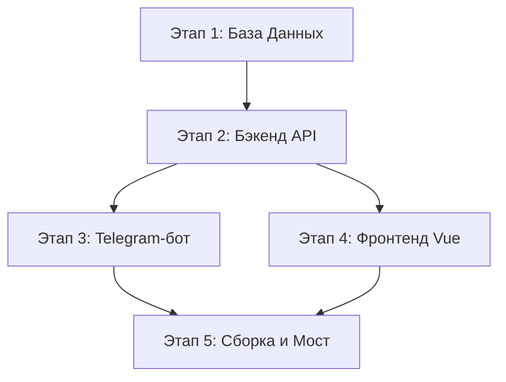

# 🏗 Шаг 4. Как написать такой проект с нуля

Если ты хочешь научиться делать такие приложения сам, вот тебе подробная карта действий. Представь, что мы строим дом: сначала рисуем чертеж, потом заливаем фундамент, строим стены и в конце красим фасад.

---

## 🗺 Карта разработки (5 основных этапов)



---

## 🛠 Этап 1. Проектируем Базу Данных (Чертеж дома)

Сначала реши, какие данные тебе нужно хранить.
1. Установи СУБД (например, PostgreSQL или зарегистрируйся на бесплатном [Supabase](https://supabase.com)).
2. Нарисуй таблицы. Тебе пригодятся:
   * **Users** (игроки)
   * **Venues** (спортивные площадки)
   * **Events** (матчи)
   * **EventApplications** (кто куда записался)
3. Напиши SQL-код (или используй конструктор таблиц на Supabase), чтобы создать эти таблицы. Наш чертеж лежит в файле `backend/sql/schema.sql`.

---

## 🧠 Этап 2. Создаем Бэкенд на Python (Фундамент и стены)

Бэкенд лучше писать на **FastAPI** — это быстро и современно.
1. **Подключись к базе данных:** Используй библиотеку `SQLAlchemy` (в асинхронном режиме) для отправки запросов в базу из кода на Python.
2. **Опиши модели:** Создай Python-классы, которые повторяют таблицы базы данных (они лежат в `backend/app/models/`).
3. **Напиши первые API (эндпоинты):**
   * Получение списка площадок (`GET /api/venues`).
   * Получение списка игр (`GET /api/events/feed`).
   * Создание игры (`POST /api/events`).
4. **Добавь безопасность (Очень важно!):**
   В Telegram Mini App каждый запрос должен быть подписан. Мы берем строку `initData` от Telegram на фронтенде, отправляем её в заголовке `X-Telegram-Init-Data`, а на бэкенде с помощью секретного ключа бота проверяем подпись (код проверки лежит в `backend/app/core/security.py`). Без этого любой хакер мог бы представиться кем угодно!

---

## 🤖 Этап 3. Оживляем Telegram-бота (Двери и окна)

Для бота используй библиотеку **Aiogram 3**.
1. **Создай бота:** Напиши `@BotFather` в Telegram, создай нового бота и получи секретный Токен.
2. **Напиши диалог регистрации:**
   * Используй механизм **FSM (Finite State Machine)** — конечные автоматы. Это как анкета, где бот переходит от состояния к состоянию: `Ожидание имени` ➔ `Ожидание возраста` ➔ `Ожидание фото` ➔ `Сохранение`.
3. **Сохранение в базу:** После завершения анкеты сделай так, чтобы бот записывал данные пользователя в твою таблицу `users` в базе данных.
4. **Сделай кнопку WebApp:** Создай клавиатуру с кнопкой, которая открывает твой сайт прямо внутри Telegram (`WebAppInfo(url="твоя-ссылка-на-сайт")`).

---

## 📱 Этап 4. Рисуем красивый Фронтенд (Покраска и декор)

Фронтенд мы делаем на **Vue.js 3** + **Vite** + **Pinia**.
1. **Настрой структуру страниц:** Установи `vue-router` для переключения между экранами (Лента, Создание игры, История).
2. **Сделай красивый дизайн:** Используй CSS-стили, чтобы карточки матчей выглядели аккуратно и современно на экранах телефонов.
3. **Настрой локальное хранилище (Pinia):**
   Создай "хранилище" для пользователя (`profile.js`), чтобы один раз загрузить его профиль при старте и показывать его имя на всех страницах.
4. **Интегрируй Telegram SDK:**
   Подключи скрипт Telegram WebApp в `index.html`:
   ```html
   <script src="https://telegram.org/js/telegram-web-app.js"></script>
   ```
   Теперь в коде JavaScript тебе доступен объект `window.Telegram.WebApp`. Через него ты можешь брать данные о пользователе и подпись авторизации.

---

## 🌉 Этап 5. Наводим Мост (reverse proxy)

Чтобы фронтенд мог общаться с бэкендом без ошибок безопасности CORS, настрой файл `vite.config.js`.
Добавь блок `proxy`:
```javascript
proxy: {
  '/api': 'http://localhost:8000',
  '/bot': 'http://localhost:8000'
}
```
Теперь, когда фронтенд отправляет запрос на `/api/venues`, Vite автоматически пересылает его на `http://localhost:8000/api/venues`. И браузер думает, что всё работает на одном сайте!

---

## 🏁 Заключение

Поздравляю! Теперь у тебя есть полная инструкция, как устроен этот проект и как его написать самому. 

Если ты хочешь расширить его, вот отличные идеи для домашнего задания:
1. **Добавить выбор города:** Сейчас город по умолчанию "Тараз". Попробуй добавить в бота выбор города при регистрации.
2. **Фильтрация по видам спорта:** Сделай на фронтенде кнопки "Футбол", "Баскетбол", чтобы отсеивать ненужные матчи в ленте.
3. **Поиск площадок на карте:** Интегрируй Яндекс или Google карты, чтобы показывать маркеры площадок.

*Все эти файлы теперь сохранены в папке `guide/` в твоем проекте. Удачи в программировании! 🚀*
